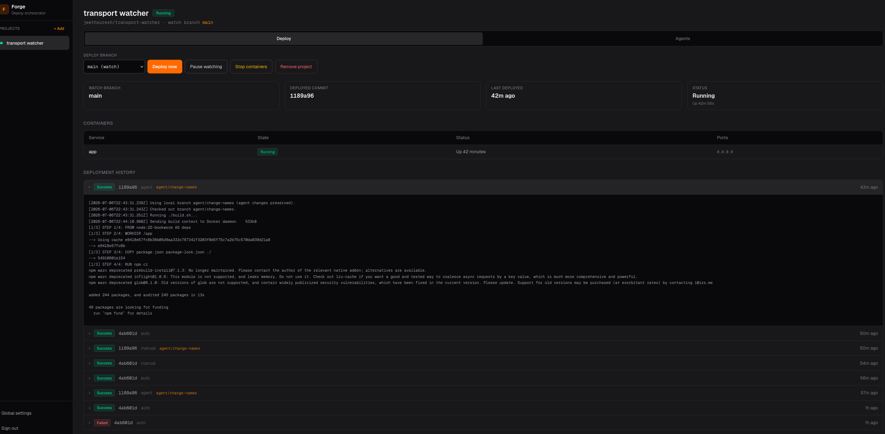
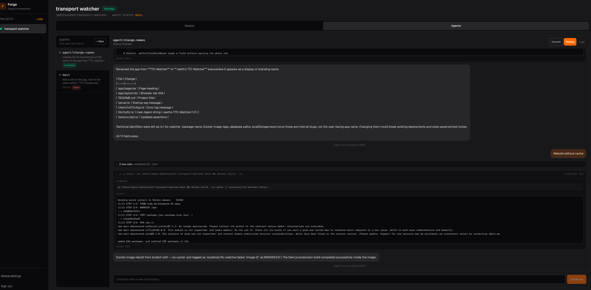

# Orchestrator

A local Docker deployment orchestrator with a web dashboard. Orchestrator watches GitHub repositories, detects changes every minute, and automatically builds, tests, and deploys them using each repo's root scripts.

## Features

- **GitHub monitoring** — polls remote branches every 60 seconds for new commits
- **Automated pipeline** — clones/pulls, runs `build.sh`, `test.sh`, then `deploy.sh`
- **Web dashboard** — login-protected UI with project sidebar, deployment history, container status, and live logs
- **SQLite tracking** — persists projects, deployments, and state locally
- **Manual controls** — trigger deploys, pause/resume watching, remove projects

## Dashboard

Each project has two tabs in the main workspace.

### Deploy



Branch selector, deploy/pause/stop controls, container status, and deployment history with expandable build logs.

### Agents



Cursor agent sessions per branch: prompt the agent, review tool output, commit changes, and deploy from the chat UI.

## Prerequisites

- Node.js 20+
- Git
- Docker and Docker Compose
- Network access to GitHub (public repos, or configure git credentials for private repos)

## Setup

```bash
npm install
cp .env.example .env.local
# Edit .env.local — set FORGE_SESSION_SECRET and admin credentials
./build.sh --skip-install
./test.sh
npm run dev
```

Open [http://localhost:3000](http://localhost:3000) and sign in with your configured credentials (default: `admin` / `admin`).

## Repository Scripts

Orchestrator and every watched repository should provide executable root scripts with CLI flags:

| Script | Purpose |
|--------|---------|
| `build.sh` | Build the app or Docker image(s) |
| `test.sh` | Run unit tests |
| `deploy.sh` | Deploy via `docker compose up` (containers only) |
| `teardown.sh` | Stop containers/processes and clean up |

Common flags (see `./build.sh --help`): `--project-name`, `--compose-file`, `--host-port`.

### Compose project name (required)

Every Docker Compose operation must use an explicit project name via `-p` / `--project-name`. Never rely on the implicit directory-based default.

- **Orchestrator-managed projects:** the compose name is derived from the Orchestrator display name (e.g. `My App` → `my-app`). Orchestrator passes `--project-name`, `COMPOSE_PROJECT_NAME`, and `PROJECT_NAME` to all pipeline scripts and uses the same name for `docker compose ps` / `down`.
- **Repo scripts:** use `compose_cmd` from `scripts/lib/common.sh`, which always runs `docker compose -f … -p "$COMPOSE_PROJECT_NAME" …`.
- **Named volumes/networks:** prefix with `${COMPOSE_PROJECT_NAME}` in `docker-compose.yml` so stacks do not collide.

Example `build.sh` for a compose-based project:

```bash
#!/usr/bin/env bash
set -euo pipefail
cd "$(dirname "$0")"
# shellcheck source=scripts/lib/common.sh
source ./scripts/lib/common.sh
parse_common_args "$@"
compose_cmd build
```

Example `deploy.sh`:

```bash
#!/usr/bin/env bash
set -euo pipefail
cd "$(dirname "$0")"
# shellcheck source=scripts/lib/common.sh
source ./scripts/lib/common.sh
parse_common_args "$@"
compose_cmd up -d
```

Example `test.sh`:

```bash
#!/usr/bin/env bash
set -euo pipefail
cd "$(dirname "$0")"
npm test
```

Example `teardown.sh`:

```bash
#!/usr/bin/env bash
set -euo pipefail
cd "$(dirname "$0")"
# shellcheck source=scripts/lib/common.sh
source ./scripts/lib/common.sh
parse_common_args "$@"
compose_cmd down --remove-orphans
```

Legacy minimal examples (only if the repo has no `scripts/lib/common.sh`):

```bash
#!/usr/bin/env bash
set -euo pipefail
cd "$(dirname "$0")"
PROJECT_NAME="${COMPOSE_PROJECT_NAME:-${PROJECT_NAME:-myapp}}"
docker compose -p "$PROJECT_NAME" up -d "$@"
```

Make all four scripts executable (`chmod +x build.sh test.sh deploy.sh teardown.sh`).

## Watched Repository Requirements

Each repository you add must have these files in its root:

- `build.sh` — builds Docker image(s) or app artifacts
- `test.sh` — runs unit tests (pipeline fails if tests fail)
- `deploy.sh` — runs `docker compose up` (or equivalent) to deploy
- `teardown.sh` — stops containers and removes resources
- `docker-compose.yml` — required for `deploy.sh` / `teardown.sh`

## Adding a Project

1. Sign in to the dashboard
2. Click **Add project** in the sidebar
3. Enter a display name, GitHub repo (`owner/repo`), and branch
4. Orchestrator clones the repo to `FORGE_REPOS_DIR` and begins watching

On the first detected change (or a manual **Deploy now**), Orchestrator runs the full pipeline.

## Environment Variables

| Variable | Default | Description |
|----------|---------|-------------|
| `FORGE_SESSION_SECRET` | dev fallback | Iron-session encryption key (32+ chars) |
| `FORGE_ADMIN_USERNAME` | `admin` | Initial admin username |
| `FORGE_ADMIN_PASSWORD` | `admin` | Initial admin password |
| `FORGE_DB_PATH` | `./data/forge.db` | SQLite database path |
| `FORGE_REPOS_DIR` | `./data/repos` | Local clone directory |

## Production

```bash
cp .env.example .env
# Edit .env — set FORGE_SESSION_SECRET and admin credentials
./build.sh
./test.sh
./deploy.sh --host-port 3000
```

Orchestrator runs in Docker with the host container socket mounted so it can deploy watched repositories. `deploy.sh` auto-detects Podman/Docker sockets (and starts `podman.socket` on rootless hosts when needed); override with `DOCKER_SOCKET` if required.

## Architecture

```
┌─────────────┐     every 60s      ┌──────────────┐
│   Watcher   │ ────────────────▶  │ GitHub API   │
│ (instrument)│                    │ git ls-remote│
└──────┬──────┘                    └──────────────┘
       │ on change
       ▼
┌─────────────┐   build.sh    ┌──────────────┐
│  Deployer   │ ────────────▶ │ Docker build │
│             │   test.sh     │ unit tests   │
│             │   deploy.sh   │ compose up   │
└──────┬──────┘ ────────────▶ └──────────────┘
       │
       ▼
┌─────────────┐
│   SQLite    │  projects, deployments, logs
└─────────────┘
```
